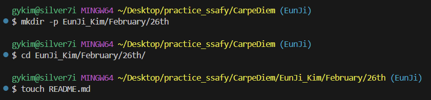

# CarpeDiem
"현재를 잡아라"라는 라틴어 격언
> ## 🎯스터디 목적
### "오늘의 할 일을 내일로 미루지 말자"
본 스터디는 __실행력(Execution)__ 과 __지속성(Consistency)__ 을 최우선 가치로 삼습니다. 단순히 지식을 습득하는 것을 넘어, 매일 계획한 목표를 완수함으로써 '미루지 않는 습관'을 체득하고 함께 성장하는 것을 목적으로 합니다.
1. git 잔디심기
2. 매일 열심히 문제 풀기  

---

✳️ 스터디 진행 계획
``` java
1. 매일, 문제 푼거 진행도 공유
2. 금 오전 8시 오프라인 모임
    (한 주 피드백 시간)
3. 그 주에 못 한건 주말에 마무리 후 공유
    💥주말까지 완료 못하면 커피쏘기!
```

.       
.
##
#### 🗂️ 폴더 구조
> `form/month/day/..`         
> `form/image/..`
```
각 폴더 README.md 에 적을 내용
- month : 월간 목표 작성 / 월간 회고록 작성
- week  : 주간 목표 / 주간 회고록 작성
- day   : 당일의 공부 기록
```
##
### 📍주의!
 - 모든 폴더/파일 명은 __영어__ 로 작성.    
    __공백 금지__! 하이픈( - )이나 언더바( _ ) 사용하기
 - __각자의 브랜치__ 에서 작업  
    (관련 내용은 하단의 브랜치 설명 확인)
    

##
        
### ▣ 폴더 관리 방법
1. form 폴더 구조대로 개인 폴더 생성하기  
    - form : 영문 이름 (ex. EunJi_Kim)
    - month : 월 (ex. Feb. or February)
    - week : 주 (ex. 1_week)
    - day : 일 (ex. 26th)   
    (month/week/day 폴더는 날짜별로 생성해서 사용)
2. day 폴더 안에서 학습내용 기록하기
    - day 이하 폴더 관리는 개성껏
    - day 폴더 안의 README.md 에 기록하기
3. README 에 넣을 이미지는 image 폴더 생성해서 관리하기

---
####
[git 사용법 공부하기 좋은 url](https://moonhy7.tistory.com/entry/Github-%EB%AA%85%EB%A0%B9%EC%96%B4-%EC%A0%95%EB%A6%AC)

##

###  
.       
.       

## 브랜치 ▼

📍작업 전 __항상 pull 받고 시작하기__       
📍작업 전 __항상 브랜치 위치 확인하기__!
> 1. 작업 하기 전에 `$ git branch` 로 본인이 현재 어디에 위치해 있는지 확인하세요.     
>   1-1. 본인의 브랜치가 없다면, `$ git branch <새로운_브랜치명>` 으로 생성하세요.
> 2. 본인의 브랜치로 이동하세요. `$ git switch <브랜치명>`
> 3. 다시 `$ git branch`로 정상적으로 이동 되었는지 확인하세요.

### ▣ Git Bash 브랜치 관리 핵심 명령어
```💫 표시 있는 명령어는 계속 사용하게 됩니다.```       
- __브랜치 목록 조회__ 💫 : `git branch`              
    - *가 붙은 것이 현재 작업 중인 브랜치입니다.      
    - -a 옵션을 사용하여 원격 브랜치까지 모두 조회 가능합니다.            
- __브랜치 생성__ 💫 : `git branch <새로운_브랜치명>`        
- __브랜치 이동 (체크아웃)__ 💫 : `git switch <브랜치명>` (추천) 또는 `git checkout <브랜치명>`
- __브랜치 생성 및 이동 동시 수행__ : `git switch -c <새로운_브랜치명>`
- __브랜치 이름 변경__ : `git branch -m <기존_이름> <새로운_이름>`
- __브랜치 삭제__ : `git branch -d <삭제할_브랜치명>`
    - 병합되지 않은 브랜치를 강제 삭제하려면 `-D` 옵션을 사용합니다.
- __브랜치 병합__ :
    - `git switch <합칠_대상_브랜치>` (예: main)로 이동.
    - `git merge <가져올_브랜치명>`
- __원격 브랜치 반영__ 💫 : `git push origin <브랜치명>` 


---
---
.       
.       

### 🚀 Git 특정 폴더/파일 선별적 가져오기 가이드

일반적인 `merge` 시 발생하는 **불필요한 파일 삭제나 꼬임**을 방지하고, 필요한 항목만 안전하게 가져오는 방법입니다.

---

#### 1️⃣ 다른 브랜치에서 특정 폴더/파일만 복사하기 (가장 권장)
브랜치 전체를 합치지 않고, 필요한 항목의 **최신 상태**만 현재 브랜치로 가져옵니다.
* **장점:** 다른 폴더가 삭제되는 부작용이 전혀 없음.
* **명령어:**
  ```
  git checkout [대상_브랜치명] -- [폴더_또는_파일_경로]
  ```
  `(예: git checkout feature/AA -- src/components/form)`

---

#### 2️⃣ 특정 커밋의 변경 내용만 반영하기 (Cherry-pick)
상대방이 작업한 특정 **'기록(커밋)'**만 쏙 빼서 내 브랜치에 적용합니다.
* **언제:** 특정 기능 구현이나 버그 수정 커밋 하나만 필요할 때.
* **명령어:**
  ```
  git cherry-pick [커밋_해시값]
  ```

---

#### 3️⃣ 머지 후 사라진 폴더 강제 복구하기
이미 `merge`를 실행하여 폴더가 지워졌을 때, 머지 직전 상태에서 폴더만 소환합니다.
* **명령어:**
  ```
  git checkout ORIG_HEAD -- [삭제된_폴더_경로]
  ```       
  (참고: ORIG_HEAD는 머지/리셋 직전의 상태를 가리키는 포인터입니다.)

---

#### 4️⃣ 코드 조각 단위로 선택해서 가져오기 (Patch)
파일 전체가 아니라 바뀐 **코드 한 줄 한 줄**을 확인하며 가져올지 결정합니다.
* **명령어:**
    ```
    git checkout -p [대상_브랜치명] -- [파일_경로]
    ```
---

#### 💡 실무 Tip: "왜 자꾸 폴더가 지워질까?"
* **원인:** 상대방 브랜치에서 해당 폴더를 삭제한 이력이 있다면, Git은 이를 **최신 업데이트**로 간주하여 머지 시 내 브랜치에서도 삭제합니다.
* **해결:** 전체 merge 대신 **1번 방법(checkout)** 을 사용하여 필요한 폴더만 명시적으로 가져오세요.

---

### ✅ 커밋 전 이메일/작성자 확인 필수!
커밋하기 전, 잘못된 계정으로 기록되지 않도록 아래 명령어로 확인하세요.

#### 현재 설정된 이름과 이메일 확인
```
git config user.name
git config user.email
```

#### 잘못 설정되어 있다면 즉시 수정 (현재 폴더 한정)
```
git config user.email "내-깃허브-이메일@example.com"
```

#### 만약 이미 커밋을 했다면? (직전 커밋 저자 정보 덮어쓰기)
```
git commit --amend --reset-author --no-edit
```
.       
.       
------
------
.           
.           
### 💡 유용한 팁
- __브랜치 상태 확인__ : `git log --oneline --graph --all` 명령어를 통해 브랜치 구조를 시각적으로 확인할 수 있습니다.      
- __원격 브랜치 목록 갱신__ : `git fetch --all`을 사용해 최신 원격 브랜치 정보를 가져옵니다. 

---
###
- 브랜치 이동하기           
   
    경로 뒤에 붙은 (브랜치 명) 확인

- 폴더 생성 및 이동하기     
           
- 개인 브랜치에서 push하기      


github에서 브랜치 확인      
| |  |
| --- | --- |

